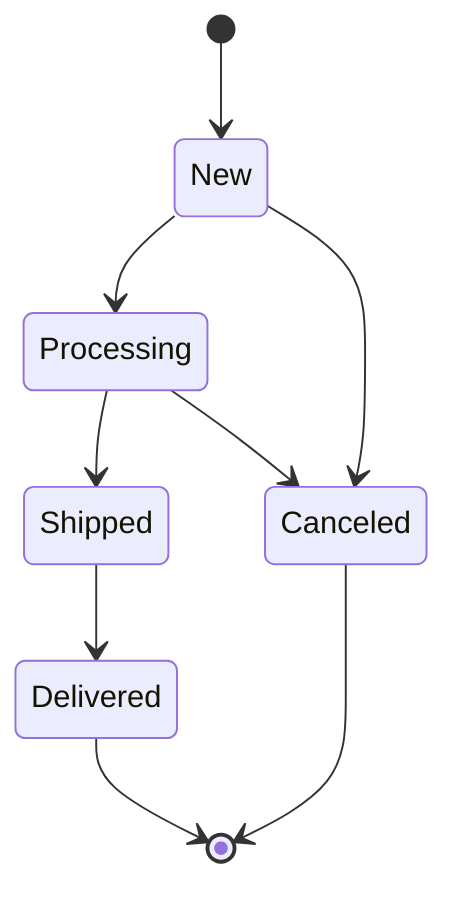

# Model States for Filament

<p class="filament-hidden">
  <a href="https://checkout.anystack.sh/model-states-for-filament">
    
  </a>
</p>

## Introduction

The Model States for Filament plug-in is a powerful tool that seamlessly integrates model states and transitions into
the [Filament](https://filamentphp.com) UI. It
supports [Spatie Laravel Model States](https://spatie.be/docs/laravel-model-states/v2/01-introduction) out-of-the-box,
which makes transitioning, listing, and filtering states effortless tasks.

## Example

Consider a scenario where you're managing an e-commerce platform with various order states
like `new`, `processing`, `shipped`, `delivered`, and `canceled`. With this plug-in, you can effortlessly list all
products based on their states, apply filters to quickly locate specific orders in each state, and seamlessly transition
between states directly within Filament's intuitive interface. For instance, you can move an order from `processing`
to `shipped` with just a few clicks, streamlining your workflow and enhancing productivity.

**This plug-in leverages the robust capabilities of Filament PHP and the support of Spatie Laravel Model States
out-of-the-box, providing a seamless solution for managing model states and transitions with efficiency and ease.**

### Demo video

[](https://www.youtube.com/watch?v=yy6AcehrVYI)

Check out this video demonstrating how straightforward it is to transition from one valid state to another using
Filament, with the following transitions in mind:



## Features

Model States for Filament comes packed with a range of features to enhance your experience:

- Listing states within tables and exports.
- Filtering records by states.
- Grouping records by states.
- Transitioning to valid states using select or toggle button components.
- Transitioning to valid states using page and table actions.
- Out-of-the-box support for
  the [Spatie Laravel Model States](https://spatie.be/docs/laravel-model-states/v2/01-introduction) package.
- Compatible with dark mode.

## Installation

**Thank you for choosing Model States for Filament!**

Here's a comprehensive guide to installing and utilizing this plug-in. If you encounter any issues, have questions, need
support, or want to request a feature, please feel free to contact me
at [maartenpaauw@gmail.com](mailto:maartenpaauw@gmail.com).

### Requirements

- PHP `^8.1`
- Laravel `^10.0` or `^11.0`
- Filament `^3.2.39`
- Spatie Laravel model states `^2.7`

Additionally, make sure you have configured at least one Spatie Laravel model state in your project. For more
information, refer to the official
Spatie [documentation](https://spatie.be/docs/laravel-model-states/v2/01-introduction).

### Installation steps

#### Install with Composer

To begin, add the private registry to your `composer.json`:

```json
{
    "repositories": [
        {
            "type": "composer",
            "url": "https://model-states-for-filament.composer.sh"
        }
    ]
}
```

Once the repository is added, you can install Model States for Filament like any other composer package:

```shell
composer require maartenpaauw/model-states-for-filament
```

You will be prompted to provide your username and password. The username will be your email address and the password
will be equal to your license key, followed by a colon (`:`), followed by the domain you are activating. For example,
let's say we have the following licensee and license activation:

- Contact email: `john.doe@example.com`
- License key: `8c21df8f-6273-4932-b4ba-8bcc723ef500`
- Activation fingerprint: `example.com`

This will require you to enter the following information when prompted for your credentials:

```shell
Loading composer repositories with package information
Authentication required (model-states-for-filament.composer.sh):
Username: john.doe@example.com 
Password: 8c21df8f-6273-4932-b4ba-8bcc723ef500:example.com
```

To clarify, the license key and fingerprint should be separated by a colon (`:`).

#### Publishing

The plug-in offers English and Dutch translations. You can publish the language files if needed:

```shell
php artisan vendor:publish --tag="model-states-for-filament-translations"
```

### Deploying

It is not advised to store your `auth.json` file inside your project's version control repository. To store your
credentials on your deployment server you may create a Composer `auth.json` file in your project directory using the
following command:

```shell
composer config http-basic.model-states-for-filament.composer.sh your_account_email your_license_key:fingerprint_domain
```

You can see your credentials in your [Anystack.sh account](https://anystack.sh/): `Anystack -> Transactions -> View
details` next to Model States for Filament.

> [!IMPORTANT]
> Make sure the `auth.json` file is in `.gitignore` to avoid leaking credentials into your git history.

If you are using [Laravel Forge](http://forge.laravel.com/), you don't need to create the `auth.json` file manually.
Instead, you can set the credentials on the `Composer Package Authentication` screen of your server.

## Setup

In this paragraph, we list the steps you need to follow to get up and running with the out-of-the-box supported Spatie
integration.

### Spatie

Make sure you have configured at least one Spatie Laravel model state. For more information, refer to the official
Spatie [documentation](https://spatie.be/docs/laravel-model-states/v2/01-introduction).

#### State Preparation

When utilizing Spatie Laravel Model States, you'll have several abstract state classes. These abstract classes
require certain modifications. To properly integrate them, it's necessary to implement the `FilamentSpatieState`
interface and utilize the `ProvidesSpatieStateToFilament` trait.

Here's an example of the `OrderState` abstract class with the necessary modifications already applied.

```php
<?php

namespace App\States;

use App\Models\Order;
use Maartenpaauw\Filament\ModelStates\Concerns\ProvidesSpatieStateToFilament;
use Maartenpaauw\Filament\ModelStates\Contracts\FilamentSpatieState;
use Spatie\ModelStates\State;
use Spatie\ModelStates\StateConfig;

/**
 * @extends State<Order>
 */
abstract class OrderState extends State implements FilamentSpatieState
{
    use ProvidesSpatieStateToFilament;
    
    public static function config(): StateConfig
    {
        return parent::config()
            ->default(NewState::class)
            ->allowTransition(NewState::class, ProcessingState::class)
            ->allowTransition(ProcessingState::class, ShippedState::class)
            ->allowTransition(ShippedState::class, DeliveredState::class)
            ->allowTransition([NewState::class, ProcessingState::class], CancelledState::class, ToCancelled::class);
    }
}
```

> [!TIP]
> More information about state configuration can be found in the official
> Spatie [documentation](https://spatie.be/docs/laravel-model-states/v2/working-with-states/01-configuring-states).

#### Transition Preparation

Spatie Laravel model states offer support for custom transition classes. All custom transition classes must implement
the `FilamentSpatieTransition` interface and use the `ProvidesSpatieTransitionToFilament` trait before they can be used
within Filament.

Here is an example of the `ToCancelled` transition class with the necessary modifications in place.

```php
<?php

namespace App\States;

use App\Models\Order;
use Maartenpaauw\Filament\ModelStates\Concerns\ProvidesSpatieTransitionToFilament;
use Maartenpaauw\Filament\ModelStates\Contracts\FilamentSpatieTransition;
use Spatie\ModelStates\Transition;

/**
 * @implements FilamentSpatieTransition<Order>
 */
final class ToCancelled extends Transition implements FilamentSpatieTransition
{
    use ProvidesSpatieTransitionToFilament;
    
    public function __construct(
        private readonly Order $order,
    ) {
    }
    
    public function handle(): Order
    {
        $this->order->state = new CancelledState($this->order);
        $this->order->cancelled_at = now();

        $this->order->save();

        return $this->order;
    }
}
```

> [!TIP]
> For more information about transition configuration, refer to the official Spatie
> [documentation](https://spatie.be/docs/laravel-model-states/v2/working-with-transitions/02-custom-transition-classes).

##### Additional Transition Data

Most of the time, additional data is needed before transitioning to a new state. Considering the `ToCancelled`
transition, it would be beneficial to store a reason explaining why the state transitioned to cancelled state. By adding
a `form` method to the transition class, a form will be displayed when initiating the transition.

Here is an example `ToCancelled` transition class with the form is place. This transition will display a reason
textarea when the `StateAction` or `StateTableAction` button is clicked.

```php
<?php

namespace App\States;

use App\Models\Order;
use Maartenpaauw\Filament\ModelStates\Concerns\ProvidesSpatieTransitionToFilament;
use Maartenpaauw\Filament\ModelStates\Contracts\FilamentSpatieTransition;
use Spatie\ModelStates\Transition;

/**
 * @implements FilamentSpatieTransition<Order>
 */
final class ToCancelled extends Transition implements FilamentSpatieTransition
{
    use ProvidesSpatieTransitionToFilament;

    public function __construct(
        private readonly Order $order,
        private readonly string $reason = '',
    ) {
    }

    public function handle(): Order
    {
        $this->order->state = new CancelledState($this->order);
        $this->order->cancelled_at = now();
        $this->order->cancellation_reason = $this->reason;

        $this->order->save();

        return $this->order;
    }

    public function form(): array | Closure | null
    {
        return [
            Textarea::make('reason')
                ->required()
                ->minLength(1)
                ->maxLength(1000)
                ->rows(5)
                ->helperText(__('This reason will be sent to the customer.')),
        ];
    }
}
```

> [!WARNING]
> Since the plug-in needs to create transition instances to determine if there is a form, all constructor properties,
> except for the model, must have default values.

By default, this plug-in will map the form component names to their constructor property names. Considering the
previous `ToCancelled` transition, the `reason` textarea input will correspond to the constructor property `$reason`. If
you want to make any modifications before creating the transition instance, you can override the static method `fill`.

For example, you can prefix the `reason`:

```php
<?php

namespace App\States;

use App\Models\Order;
use Illuminate\Support\Arr;
use Maartenpaauw\Filament\ModelStates\Concerns\ProvidesSpatieTransitionToFilament;
use Maartenpaauw\Filament\ModelStates\Contracts\FilamentSpatieTransition;
use Spatie\ModelStates\Transition;

/**
 * @implements FilamentSpatieTransition<Order>
 */
final class ToCancelled extends Transition implements FilamentSpatieTransition
{
    use ProvidesSpatieTransitionToFilament;

    public function __construct(
        private readonly Order $order,
        private readonly string $reason = '',
    ) {
    }

    public static function fill(Model $model, array $formData): SpatieTransition
    {
        return new self(
            order: $model,
            reason: 'The order is cancelled because: ' . Arr::get($formData, 'reason'),
        );
    }

    public function handle(): Order
    {
        $this->order->state = new CancelledState($this->order);
        $this->order->cancelled_at = now();
        $this->order->cancellation_reason = $this->reason;

        $this->order->save();

        return $this->order;
    }

    public function form(): array | Closure | null
    {
        return [
            Textarea::make('reason')
                ->required()
                ->minLength(1)
                ->maxLength(1000)
                ->rows(5)
                ->helperText(__('This reason will be sent to the customer.')),
        ];
    }
}
```

#### Optional Label, Description, Color and Icon

By default, the name of the state class is used as a label (for example, `CancelledState` will have the
label `Cancelled`), without any assigned description, color or icon. If you desire a different label, description,
color, or icon, you must implement the `HasLabel`, `HasDescription`, `HasColor`, or `HasIcon` interface.

Here is an example of the `Cancelled` state with `HasLabel`, `HasDescription`, `HasColor`, and `HasIcon` implemented.

```php
<?php

namespace App\States;

use Filament\Support\Colors\Color;
use Filament\Support\Contracts\HasColor;
use Filament\Support\Contracts\HasDescription;
use Filament\Support\Contracts\HasIcon;
use Filament\Support\Contracts\HasLabel;

final class CancelledState extends OrderState implements HasDescription, HasColor, HasIcon, HasLabel
{
    public function getLabel(): string
    {
        return __('Order Cancelled');
    }

    public function getColor(): array
    {
        return Color::Red;
    }
    
    public function getIcon(): string
    {
        return 'heroicon-o-x-circle';
    }

    public function getDescription(): ?string
    {
        return 'Order cancelled, transaction reversed.';
    }
}
```

> [!NOTE]
> The description is used when utilizing the `StateRadio` component.

By default, "Transition to" followed by the name of the destination state is used as the transition label. Like states,
it has no color or icon. If you want a different label, or if you want to use a color or icon; you have to implement
the `HasLabel`, `HasColor` or `HasIcon` interface.

Here is an example `ToCancelled` transtition with `HasLabel`, `HasColor` and `HasIcon` implemented.

```php
<?php

namespace App\States;

use App\Models\Order;
use Filament\Support\Colors\Color;
use Filament\Support\Contracts\HasColor;
use Filament\Support\Contracts\HasIcon;
use Filament\Support\Contracts\HasLabel;
use Maartenpaauw\Filament\ModelStates\Concerns\ProvidesSpatieTransitionToFilament;
use Maartenpaauw\Filament\ModelStates\Contracts\FilamentSpatieTransition;
use Spatie\ModelStates\Transition;

/**
 * @implements FilamentSpatieTransition<Order>
 */
final class ToCancelled extends Transition implements FilamentSpatieTransition, HasLabel, HasColor, HasIcon
{
    use ProvidesSpatieTransitionToFilament;

    public function __construct(
        private readonly Order $order,
        private readonly string $reason = '',
    ) {
    }

    public function handle(): Order
    {
        $this->order->state = new CancelledState($this->order);
        $this->order->cancelled_at = now();
        $this->order->cancellation_reason = $this->reason;

        $this->order->save();

        return $this->order;
    }

    public function getLabel(): string
    {
        return __('Mark as Cancelled');
    }

    public function getColor(): array
    {
        return Color::Red;
    }
    
    public function getIcon(): string
    {
        return 'heroicon-o-x-circle';
    }

    public function form(): array | Closure | null
    {
        return [
            Textarea::make('reason')
                ->required()
                ->minLength(1)
                ->maxLength(1000)
                ->rows(5)
                ->helperText(__('This reason will be sent to the customer.')),
        ];
    }
}
```

#### Migrating Away from Enum States

For each enum case, you have to create a state class. When you used string-backed enums, don't forget to add the public
static string `$name` property. This is because, by default, Spatie Model States uses the fully qualified class name as
the state representation and stores it in the database. To be backward compatible with the old enum values, you have to
implement the static string property.

> [!TIP]
> More information about state serializing can be found in the official
> Spatie [documentation](https://spatie.be/docs/laravel-model-states/v2/working-with-states/02-serializing-states).

## Usage

In this paragraph, all available components and their features are listed.

### State Column

The `StateColumn` will display the related model state within a table.


_State column with color and icon._

```php
use Maartenpaauw\Filament\ModelStates\StateColumn;

// ...

StateColumn::make('state')
    ->badge();
```

When utilizing the `StateColumn` component, this plug-in will automatically generate a label for the current state. If
you desire a custom label, you can implement the `HasLabel` interface.

Because the `StateColumn` component is based on the `TextColumn` component, all the familiar `TextColumn` modifiers can
be used (e.g., `badge()`).

> [!TIP]
> For more information about columns, refer to the official
> Filament [documentation](https://filamentphp.com/docs/3.x/tables/columns/getting-started).

### State Entry

The `StateEntry` will display the related model state within an infolist.


_State entry with color and icon._

```php
use Maartenpaauw\Filament\ModelStates\StateEntry;

// ...

StateEntry::make('state')
    ->badge();
```

When utilizing the `StateEntry` component, this plug-in will automatically generate a label for the current state. If
you desire a custom label, you can implement the `HasLabel` interface.

Because the `StateEntry` component is based on the `TextEntry` component, all the familiar `TextEntry` modifiers can be
used (e.g., `badge()`).

> [!TIP]
> For more information about entries, refer to the official
> Filament [documentation](https://filamentphp.com/docs/3.x/infolists/entries/getting-started).

### State Select Column

> [!CAUTION]
> When using a state select column in combination with the Spatie integration, states aren't transitioned using
> the `Transition` classes and are directly saved to the database like regular fields. Only use this select when you are
> sure you are not relying on `Transition` classes and `StateChanged` events.

The `StateSelectColumn` is a table component that enables selecting valid state transitions, disabling all other invalid
state transitions. This component is intended for basic state transitions that do not require additional form fields.


_State select column with disabled invalid transitions._

```php
use Maartenpaauw\Filament\ModelStates\StateSelectColumn;

// ...

StateSelectColumn::make('state');
```

When utilizing the `StateSelectColumn` component, this plug-in will automatically list all states using their generated
class name label. If you desire a custom label, you can implement the `HasLabel` interface.

Because the `StateSelectColumn` is based on the `SelectColumn` component, all the familiar `Select` modifiers can be
used (e.g., `label()`).

> [!TIP]
> For more information about select columns, refer to the official
> Filament [documentation](https://filamentphp.com/docs/3.x/tables/columns/select).

### State Select

> [!CAUTION]
> When using a state select in combination with the Spatie integration, states aren't transitioned using
> the `Transition` classes and are directly saved to the database like regular fields. Only use this select when you are
> sure you are not relying on `Transition` classes and `StateChanged` events.

The `StateSelect` is a form component that enables selecting valid state transitions, disabling all other invalid state
transitions. This component is intended for basic state transitions that do not require additional form fields.


_State select with disabled invalid transitions._

```php
use Maartenpaauw\Filament\ModelStates\StateSelect;

// ...

StateSelect::make('state')
    ->native(false);
```

When utilizing the `StateSelect` component, this plug-in will automatically list all states using their generated class
name label. If you desire a custom label, you can implement the `HasLabel` interface.

Because the `StateSelect` is based on the `Select` component, all the familiar `Select` modifiers can be used (
e.g., `native()`).

> [!TIP]
> For more information about selects, refer to the official
> Filament [documentation](https://filamentphp.com/docs/3.x/forms/fields/select).

### State Toggle Buttons

> [!CAUTION]
> When using a state toggle button in combination with the Spatie integration, states aren't transitioned using
> the `Transition` classes and are directly saved to the database like regular fields. Only use this toggle button when
> you are sure you are not relying on `Transition` classes and `StateChanged` events.

Similar to the `StateSelect`, the `StateToggleButtons` is a form component that enables selecting valid state
transitions, disabling all other invalid state transitions. This component is intended for basic state transitions that
do not require additional form fields.


_State toggle buttons with disabled invalid transitions._

```php
use Maartenpaauw\Filament\ModelStates\StateToggleButtons;

// ...

StateToggleButtons::make('state')
    ->inline();
```

When utilizing the `StateToggleButtons` component, this plug-in will automatically list all states using their generated
class name label. If you desire a custom label, you can implement the `HasLabel` interface.

Because the `StateToggleButtons` is based on the `ToggleButtons` component, all the familiar `ToggleButtons` modifiers
can be used (e.g., `inline()`).

> [!TIP]
> For more information about toggle buttons, refer to the official
> Filament [documentation](https://filamentphp.com/docs/3.x/forms/fields/toggle-buttons).

### State Radio

> [!CAUTION]
> When using a state radio in combination with the Spatie integration, states aren't transitioned using the `Transition`
> classes and are directly saved to the database like regular fields. Only use this radio when you are sure you are not
> relying on `Transition` classes and `StateChanged` events.

The `StateRadio` is a form component that enables choosing valid state transitions, disabling all other invalid state
transitions. When the state class implements the `HasDescription` interface, the description is displayed underneath the
state label. This component is intended for basic state transitions that do not require additional form fields.


_State radio with disabled invalid transitions._


_State radio with description and disabled invalid transitions._

```php
use Maartenpaauw\Filament\ModelStates\StateRadio;

// ...

StateRadio::make('state')
    ->inline();
```

When utilizing the `StateRadio` component, this plug-in will automatically list all states using their generated class
name label. If you desire a custom label, you can implement the `HasLabel` interface.

Because the `StateRadio` is based on the `Radio` component, all the familiar `Radio` modifiers can be used (
e.g., `inline()`).

> [!TIP]
> For more information about the radio input, refer to the official
> Filament [documentation](https://filamentphp.com/docs/3.x/forms/fields/radio).

### State Action

The `StateAction` component allows you to transition a state to another valid state. Basic transitions will only show a
confirmation dialogue, while advanced state transitions display an additional form before the transition can be
performed.


_Simple state transition action._


_Advanced state transition action with additional form._

```php
use App\States\CancelledState;
use Maartenpaauw\Filament\ModelStates\StateAction;

// ...

StateAction::make('cancel')
    ->transitionTo(CancelledState::class);
```

When utilizing the `StateAction` component, this plug-in will automatically generate a label for the transition. By
default, "Transition to" followed by the name of the destination state is used as the transition label. If you desire a
custom label, you can publish the language files and change the `transition_to_state` translation, or you can implement
the `HasLabel` interface.

Because the `StateAction` component is based on the `Action` component, all the familiar `Action` modifiers can be
used (e.g., `closeModalByClickingAway()`).

> [!TIP]
> For more information about actions, refer to the official
> Filament [documentation](https://filamentphp.com/docs/3.x/actions/overview).

#### Different Attribute Name

By default, this plug-in assumes the attribute where the state is stored is named `state`. If you wish to use a
different attribute name, you can configure it using the `attribute()` method. For example, the following code uses the
attribute `status` to store the model state.

```php
use App\States\CancelledState;
use Maartenpaauw\Filament\ModelStates\StateAction;

// ...

StateAction::make('cancel')
    ->attribute('status')
    ->transitionTo(CancelledState::class);
```

### State Table Action

The `StateTableAction` component enables transitioning a state to another valid state. Basic transitions will only
display a confirmation dialogue, while advanced state transitions will show an additional form before the transition can
be completed.


_Simple state table transition action._


_Advanced state table transition action with additional form._

```php
use App\States\CancelledState;
use Maartenpaauw\Filament\ModelStates\StateTableAction;

// ...

StateTableAction::make('cancel')
    ->transitionTo(CancelledState::class);
```

When utilizing the `StateTableAction` component, this plug-in will automatically generate a label for the transition. By
default, "Transition to" followed by the name of the destination state is used as the transition label. If you desire a
custom label, you can publish the language files and change the `transition_to_state` translation, or you can implement
the `HasLabel` interface.

Because the `StateTableAction` component is based on the `Action` component, all the familiar `Action` modifiers can be
used (e.g., `closeModalByClickingAway()`).

> [!TIP]
> For more information about table actions, refer to the official
> Filament [documentation](https://filamentphp.com/docs/3.x/tables/actions).

#### Different Attribute Name

By default, this plug-in assumes the attribute where the state is stored is named `state`. If you wish to use a
different attribute name, you can configure it using the `attribute()` method. For example, the following code uses the
attribute `status` to store the model state.

```php
use App\States\CancelledState;
use Maartenpaauw\Filament\ModelStates\StateTableAction;

// ...

StateTableAction::make('cancel')
    ->attribute('status')
    ->transitionTo(CancelledState::class);
```

### State Select Filter

The `StateSelectFilter` component filters table records by the selected state.


_State select filter will all states listed._

```php
use Maartenpaauw\Filament\ModelStates\StateSelectFilter;

// ...

StateSelectFilter::make('state')
    ->multiple();
```

When utilizing the `StateSelectFilter` component, this plug-in will automatically list all states using their generated
class name label. If you desire a custom label, you can implement the `HasLabel` interface.

Because the `StateSelectFilter` is based on the `SelectFilter` component, all the familiar `SelectFilter` modifiers can
be used (e.g., `multiple()`).

> [!TIP]
> For more information about select filters, refer to the official
> Filament [documentation](https://filamentphp.com/docs/3.x/tables/filters/select).

### Hide State Filter

The `HideStateFilter` component adds a toggle filter which hides a specific state when enabled.


_Toggle filter which hides the cancelled state._

```php
use App\States\CancelledState;
use Maartenpaauw\Filament\ModelStates\HideStateFilter;

// ...

HideStateFilter::make('hide_cancelled')
    ->hiddenState(CancelledState::class);
```

When utilizing the `HideStateFilter` component, this plug-in will automatically generate a label for the filter. By
default, "Hide" followed by the name of the state is used as the filter label. If you desire a custom label, you can
publish the language files and change the `hide_state` translation.

Because the `HideStateFilter` is based on the `Filter` component, all the familiar `Filter` modifiers can be used (
e.g., `default()`).

> [!TIP]
> For more information about filters, refer to the official
> Filament [documentation](https://filamentphp.com/docs/3.x/tables/filters/custom).

### State Group

The `StateGroup` adds functionality to group table records based on their status.


_State group with label._

```php
use Maartenpaauw\Filament\ModelStates\StateGroup;

// ...

StateGroup::make('state')
    ->label('State');
```

When utilizing the `StateGroup` component, this plug-in will automatically generate a label for the current state. If
you desire a custom label, you can implement the `HasLabel` interface.

Because the `StateGroup` component is based on the `Group` component, all the familiar `Group` modifiers can be used (
e.g., `label()`).

> [!TIP]
> More information about groups can be found on the official
> Filament [documentation](https://filamentphp.com/docs/3.x/tables/grouping).

### State Tabs

> [!CAUTION]
> When using state tabs in combination with the Spatie integration, states need to be serialized. Otherwise, when using
> the fully qualified state name as a value, the backslashes will be removed, resulting in an invalid URL. For more
> information about state serialization, refer to the official
> Spatie [documentation](https://spatie.be/docs/laravel-model-states/v2/working-with-states/02-serializing-states).

The `StateTabs` component can be used to filter records using tabs. In addition to the state tabs, there will also be
an "All" tab to list all records. The state tabs are alphabetically ordered.


_State tabs with icon._

```php
use Maartenpaauw\Filament\ModelStates\StateTabs;

// ...

public function getTabs(): array
{
    return StateTabs::make($this->getModel())->toArray();
}
```

If you prefer not to include the "All" tab mentioned above, you can chain the `includeAllTab(false)` method.

```php
use Maartenpaauw\Filament\ModelStates\StateTabs;

// ...

public function getTabs(): array
{
    return StateTabs::make($this->getModel())
        ->includeAllTab(false)
        ->toArray();
}
```

> [!TIP]
> For more information about state tabs, refer to the official
>
Filament [documentation](https://filamentphp.com/docs/3.x/panels/resources/listing-records#using-tabs-to-filter-the-records).

### State Export Column

The `StateExportColumn` will add a column to Excel or CSV export with the related model state as the value.


_State label in cell._

```php
use Maartenpaauw\Filament\ModelStates\StateExportColumn;

// ...

StateExportColumn::make('state')
    ->label('State');
```

When utilizing the `StateExportColumn` component, this plug-in will automatically generate a label for the current
state. If you desire a custom label, you can implement the `HasLabel` interface.

Because the `StateExportColumn` component is based on the `ExportColumn` component, all the familiar `ExportColumn`
modifiers can be used (e.g., `label()`).

> [!TIP]
> For more information about exports, refer to the official
> Filament [documentation](https://filamentphp.com/docs/3.x/actions/prebuilt-actions/export).

## Advanced

### Custom State Manager

Would you like to use an alternative model state manager instead of Spatie Laravel model state? You can certainly do so.
Simply create your own manager by creating a class that implements to the `Manager` interface.

```php
<?php

declare(strict_types=1);

namespace Maartenpaauw\Filament\ModelStates\Contracts;

use Illuminate\Contracts\Validation\ValidationRule;
use Illuminate\Database\Eloquent\Scope;
use Illuminate\Support\Collection;
use Maartenpaauw\Filament\ModelStates\Operator;

interface Manager
{
    public static function make(Config $config): self;

    public function currentState(): State;

    public function defaultState(): ?State;

    /**
     * @return Collection<string, State>
     */
    public function allStates(): Collection;

    public function transformState(mixed $state): State;

    public function getTransition(PendingTransition $pendingTransition): Transition;

    public function isValidPendingTransition(PendingTransition $pendingTransition): bool;

    public function isInvalidPendingTransition(PendingTransition $pendingTransition): bool;

    public function executePendingTransition(PendingTransition $pendingTransition): void;

    /**
     * @param  array<array-key, State>|State  $states
     */
    public function scope(State | array $states, Operator $operator): Scope;

    public function validationRule(bool $required = true): ValidationRule;
}
```

After creating a custom manager, you can specify which manager to use per component. For example, when using the state
action, you can chain the `->manager(CustomManager::class)` method after creating the `StateAction`.

```php
use App\States\CustomManager;
use App\States\CancelledState;
use Maartenpaauw\Filament\ModelStates\StateAction;

// ...

StateAction::make('cancel')
    ->manager(CustomManager::class)
    ->transitionTo(CancelledState::class);
```

## Need Assistance?

Questions, bugs, feature requests, or suggestions? Feel free to contact me at maartenpaauw@gmail.com. Your feedback is
invaluable.

## Licensing Information

### Single Project License

The Single Project license allows for the utilization of Model States for Filament within a single project hosted on
one domain or subdomain. It is suitable for personal websites or websites tailored to specific clients.

If you intend to incorporate Model States for Filament into a SaaS application, you must obtain an Unlimited Projects or
Lifetime license.

Under the Single Project license, you are authorized to activate Model States for Filament up to 4 times (development,
test, staging and production).

You will receive updates and bug fixes for one year from the purchase date. If you choose not to renew your license, you
can only install the plug-in up to the latest version available before the license expiration. Renewing the license at a
discounted rate allows you to continue receiving updates and new features.

### Unlimited Projects License

The Unlimited Projects license permits the utilization of Model States for Filament across multiple domains, subdomains,
and even in SaaS applications.

You will receive updates and bug fixes for one year from the purchase date. If you choose not to renew your license, you
can only install the plug-in up to the latest version available before the license expiration. Renewing the license at a
discounted rate allows you to continue receiving updates and new features.

### Lifetime License

The Lifetime License affords the licensee the same privileges as the Unlimited License.

You will receive updates for the lifetime of the product.

### Code Distribution

Please note that the licenses for Model States for Filament prohibit the public distribution of its source code. Hence,
you cannot build and distribute applications using Model States for Filament's source code on open-source platforms.

### Questions About Licensing?

If you're uncertain about which license is appropriate for your needs, don't hesitate to reach out. Contact me at
maartenpaauw@gmail.com, and I'll be glad to assist you.
